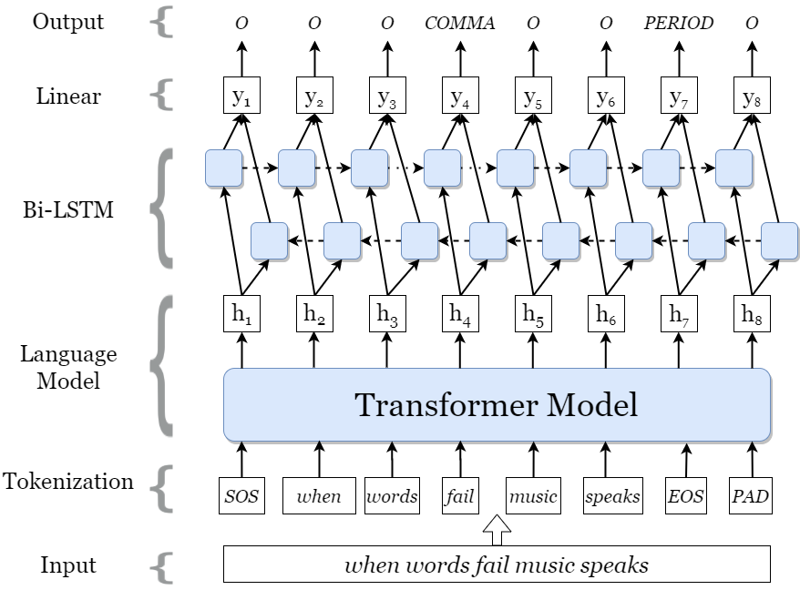

# Punctuation Restoration using Transformer Models

This repository contins official implementation of the paper *Punctuation Restoration using Transformer Modelsfor High-and Low-Resource Languages* accepted at the EMNLP workshop [W-NUT 2020](http://noisy-text.github.io/2020/).


## Data

#### English
English datasets are provided in `data/en` directory. These are collected from [here](https://drive.google.com/file/d/0B13Cc1a7ebTuMElFWGlYcUlVZ0k/view).

#### Bangla
Bangla datasets are provided in `data/bn` directory.


## Model Architecture
We fine-tune a Transformer architecture based language model (e.g., BERT) for the punctuation restoration task.
Transformer encoder is followed by a bidirectional LSTM and linear layer that predicts target punctuation token at
each sequence position.



## Dependencies
Install PyTorch following instructions from [PyTorch website](https://pytorch.org/get-started/locally/). Remaining
dependencies can be installed with the following command
```bash
pip install -r requirements.txt
```


## Training
To train punctuation restoration model with optimal parameter settings for English run the following command
```
python src/train.py --cuda=True --pretrained-model=roberta-large --freeze-bert=False --lstm-dim=-1 --language=english --seed=1
--lr=5e-6 --epoch=10 --use-crf=False --augment-type=all  --augment-rate=0.15 --alpha-sub=0.4 --alpha-del=0.4
--data-path=data --save-path=out
```
To train for Bangla the corresponding command is
```
python src/train.py --cuda=True --pretrained-model=xlm-roberta-large --freeze-bert=False --lstm-dim=-1 --language=bangla --seed=1
--lr=5e-6 --epoch=10 --use-crf=False --augment-type=all  --augment-rate=0.15 --alpha-sub=0.4 --alpha-del=0.4
--data-path=data --save-path=out
```

#### Supported models for English
```
bert-base-uncased
bert-large-uncased
bert-base-multilingual-cased
bert-base-multilingual-uncased
xlm-mlm-en-2048
xlm-mlm-100-1280
roberta-base
roberta-large
distilbert-base-uncased
distilbert-base-multilingual-cased
xlm-roberta-base
xlm-roberta-large
albert-base-v1
albert-base-v2
albert-large-v2
```

#### Supported models for Bangla
```
bert-base-multilingual-cased
bert-base-multilingual-uncased
xlm-mlm-100-1280
distilbert-base-multilingual-cased
xlm-roberta-base
xlm-roberta-large
```

## Test
Trained models can be tested on processed data using `test` module.

For example, to test the best preforming English model run following command
```bash
python src/test.py --pretrained-model=roberta-large --lstm-dim=-1 --use-crf=False --data-path=data/test
--weight-path=weights/roberta-large-en.pt --sequence-length=256 --save-path=out
```
Please provide corresponding arguments for `pretrained-model`, `lstm-dim`, `use-crf` that were used during training the
model. This will run test for all data available in `data-path` directory.
